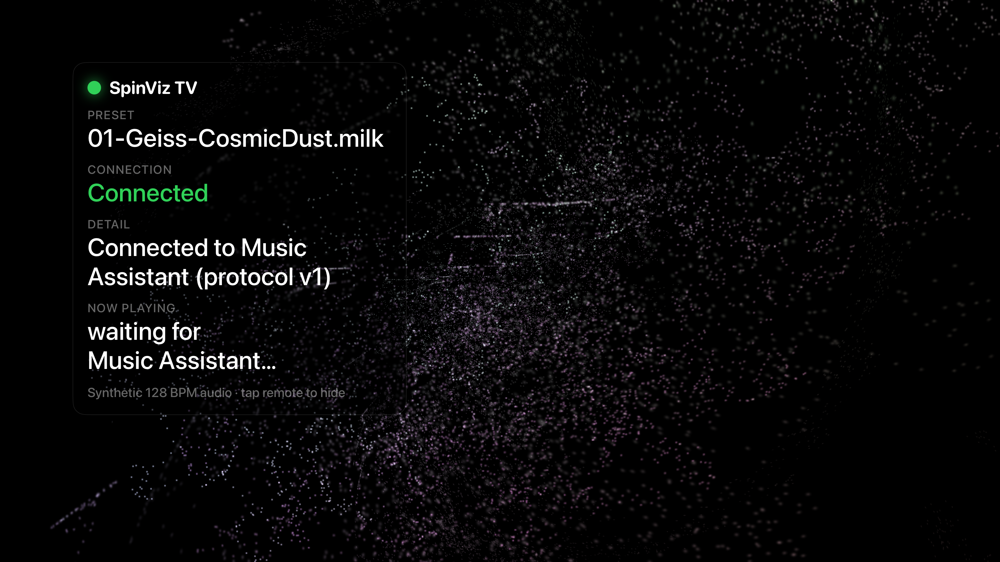

# SpinViz

**Turn any TV into a living music visualizer, synced to your whole-home audio.**

SpinViz fills your screen with classic [MilkDrop](https://en.wikipedia.org/wiki/MilkDrop)-style visuals that dance to whatever's playing on your [Music Assistant](https://music-assistant.io/) system. Thousands of hand-curated presets, hi-res synchronized audio, and a 10-foot interface built for the couch — on Android TV today, Apple TV next.

[](#)
[](#)
[](#)
[](#)

<p align="center">
  
  <br>
  <em>SpinViz running on Apple TV — a MilkDrop preset reacting to the music, now-playing details floating over the top.</em>
</p>

---

## Why SpinViz?

Music sounds better when you can *see* it. For decades, MilkDrop and Winamp turned any song into a hypnotic light show — but that magic got stranded on the desktop, right as living rooms moved to smart TVs and whole-home audio.

We already run [Music Assistant](https://music-assistant.io/) for synchronized audio across every room. We wanted the TV in each of those rooms to become part of the experience — not a black rectangle, but a screen alive with visuals that move to the exact song playing, in perfect time with the speakers.

So we built SpinViz: point it at your Music Assistant server, and every TV becomes a synchronized player *and* a full-screen visualizer. No cloud, no accounts, no subscriptions — just your music and your screens.

---

## Features

### The Visuals
- **~9,800 MilkDrop presets** — the community-curated "Cream of the Crop" collection, rendered by the [projectM](https://github.com/projectM-visualizer/projectm) engine (the same engine on every platform, so it looks identical everywhere)
- **Organized by vibe** — presets sorted into mood buckets (ambient, geometric, reaction, waveform, and more) using AI vision classification, so you can dial in a feeling instead of scrolling 9,000 files
- **Favorites** — flag the presets you love and shuffle just those
- **Visual Intensity control** — Calm / Balanced / Energetic tunes how hard the visuals react to the beat, while the frame rate stays smooth
- **Animation Speed control** — from meditative to frantic, without dropping frames
- **Auto-cycling** — let it drift through presets on its own, or lock the one you like

### The Audio
- **[Music Assistant](https://music-assistant.io/) native player** — SpinViz appears as a speaker in your whole-home audio system and plays whatever you send it
- **Synchronized, hi-res playback** — FLAC up to 96kHz/24-bit, plus Opus and PCM, over the [SendSpin protocol](https://github.com/music-assistant/aiosendspin) with sub-second time sync
- **Reacts to the real music** — the visuals are driven by the actual decoded audio, beat for beat
- **Now-Playing overlay** — album art, title, artist, progress, and transport controls, on a D-pad remote

### The Living-Room Experience
- **Built for the remote** — a true 10-foot interface: browse vibes, favorite presets, and control playback from the couch
- **Always-on** — auto-starts on boot, so the TV is a visualizer the moment it wakes
- **Screensaver mode** — hand your TV's idle screen to SpinViz
- **Runs on modest hardware** — tuned for budget smart TVs, not just flagship boxes

### Private by Design
- Everything runs on **your** devices and **your** Music Assistant server
- No cloud services, no accounts, no telemetry required
- Your music never leaves your network

---

## Screenshots

### Apple TV
| Visualizer | Auto-cycled preset |
|------------|--------------------|
|  |  |

<p align="center">
  
  <br>
  <em>Reacting to live audio — a preset warping in time with Daft Punk streamed from Music Assistant, now-playing details on the left.</em>
</p>

### Android TV
<p align="center">
  
  <br>
  <em>SpinViz on a Sony BRAVIA — idle and ready, with the live visualizer already running behind the now-playing chip.</em>
</p>

---

## Platforms

| Platform | Status |
|----------|--------|
| **Android TV** (Sony BRAVIA, NVIDIA Shield, Google TV) | ✅ Working — in daily use |
| **Apple TV** (tvOS) | 🚧 In active development — visuals + audio running |
| **Meta Quest** (VR) | 🧪 Experimental prototype |

---

## How it works

```
  Your music library / streaming
              │
        ┌─────▼─────┐
        │   Music   │   picks the track, streams synchronized
        │ Assistant │   hi-res audio over your LAN
        └─────┬─────┘
              │  SendSpin protocol (FLAC / Opus / PCM)
        ┌─────▼─────┐
        │  SpinViz  │   decodes audio → feeds the projectM engine
        │  on yourTV│   → MilkDrop visuals, in time with the speakers
        └───────────┘
```

SpinViz joins your Music Assistant setup as a standard player. Send music to it like any other speaker; it plays in sync with the rest of your home and paints the screen with visuals driven by the live audio.

---

## Built on great open source

SpinViz stands on the shoulders of:
- [projectM](https://github.com/projectM-visualizer/projectm) — the MilkDrop-compatible visualization engine
- [Music Assistant](https://music-assistant.io/) + [aiosendspin](https://github.com/music-assistant/aiosendspin) — whole-home audio and the SendSpin streaming protocol
- The MilkDrop community's "Cream of the Crop" preset collection

---

## Status

SpinViz is in active development, working every day on Android TVs in our home, with the Apple TV version close behind. Store releases are coming — watch this space, and the badges above will go live when they're ready.

*Not affiliated with Apple, Google, or the Music Assistant project.*
